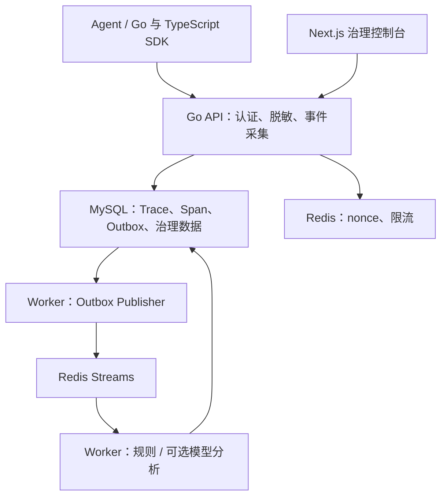

# AgentOps

**面向企业 AI Agent 的可观测性、风险分析与审计平台。**

AgentOps 将 Agent 的执行事件汇聚为 Trace 与 Span，通过规则和可选的模型分析发现风险，为团队提供执行链路调查、风险复核、策略管理和操作审计。后端采用 Go，控制台采用 Next.js，支持容器部署与 Windows 自托管安装。

> 当前实现重点是事件采集、异步风险分析与治理控制台。完整的 Agent 任务执行、任意步骤断点恢复、多 Agent 调度和工具执行前拦截仍属于后续方向；异步风险复核不等同于执行前审批。仓库中的 `AgentScope`、`agentscope` 是现有模块、数据库和协议名称。

## 核心能力

| 能力 | 当前实现 |
| --- | --- |
| 执行追踪 | 采集 Trace/Span、父子关系、事件顺序、输入快照、执行状态与 Trace 耗时；提供列表和详情查询 |
| 可靠采集 | 租户内 `event_id` 去重；事件记录与分析 Outbox 在同一 MySQL 事务中写入 |
| 异步分析 | Outbox 发布到 Redis Streams；Worker 消费、重试、接管长时间 pending 消息和死信处理 |
| 风险识别 | 确定性规则、敏感内容脱敏、可选 OpenAI 兼容模型分析及规则降级 |
| 策略与复核 | 按租户管理版本化策略、激活策略、控制规则/模型分析与输入大小；人工复核风险事件 |
| 身份与治理 | 多租户、角色权限、成员邀请、Owner 转移、OIDC/SSO、Agent 密钥轮换与撤销、操作审计 |
| 接入安全 | HMAC-SHA256 请求签名、时间窗与 Redis nonce 防重放、签名密钥加密存储 |
| 运行维护 | API 存活/就绪检查、API/Worker 指标、优雅退出、Windows CLI 与加密备份恢复 |

Trace 模型已包含 `totalTokens` 和 `estimatedCost` 字段，但当前采集路径尚未完整实现用量聚合和价格计算；这些字段不能作为已完成的计费能力。

## 架构与数据流



1. Agent 通过 SDK 上报事件。重试复用业务 `event_id`，每次请求生成新的 nonce 和签名。
2. API 校验身份与事件，脱敏后在事务中写入事件、Trace/Span 和 Outbox。
3. Worker 发布 Outbox，再通过 Redis Streams 执行风险分析，将结果写回 MySQL。
4. 控制台查询执行链路、风险事件、策略与审计记录。

异步链路按可能重复投递设计，依靠事件去重和结果唯一约束降低重复处理影响。Worker 的分析重试用于恢复后台分析任务，不会重新执行业务 Agent 的工具调用。

## 技术栈

| 层级 | 技术 |
| --- | --- |
| API / Worker | Go 1.25.13、Gin、GORM |
| 数据与消息 | MySQL 8.4、Redis 7.4 / Redis Streams、Transactional Outbox |
| Web 控制台 | Next.js、React、TypeScript、Vitest |
| Agent 接入 | Go SDK、服务端 TypeScript SDK、HMAC v1 协议 |
| 部署与交付 | Docker Compose、Windows Inno Setup、GitHub Actions；Azure 部署配置 |

具体依赖版本以 [go.mod](go.mod) 和 [web/package.json](web/package.json) 为准。

## 快速启动后端

以下命令使用 **Bash**，适用于 Linux、macOS 或 Windows WSL。需要 Git、Docker Compose v2、OpenSSL 和 curl。首次启动需要访问镜像仓库和 Go 模块源。

```bash
git clone https://github.com/jianyunyi/AgentOps.git
cd AgentOps

# 当前 shell 的本地开发配置；保留这些值，后续重启继续使用相同配置。
export MYSQL_PASSWORD="$(openssl rand -hex 24)"
export MYSQL_ROOT_PASSWORD="$(openssl rand -hex 24)"
export SESSION_SECRET="$(openssl rand -hex 32)"
export AGENT_SIGNING_ENCRYPTION_KEY="$(openssl rand -hex 32)"
export AGENT_SIGNATURE_REQUIRED=true
export WEB_ORIGIN=https://localhost:3443

# API 启动时执行数据库迁移；先等待 API 就绪，再启动 Worker。
docker compose -f docker-compose.prod.yml up -d --build mysql redis api
curl --fail --retry 30 --retry-connrefused --retry-delay 2 \
  http://localhost:8080/health/ready
docker compose -f docker-compose.prod.yml up -d --build worker
```

就绪检查成功时返回 `{"status":"ready"}`。如果失败，使用 `docker compose -f docker-compose.prod.yml logs api` 检查配置和数据库状态。

上述随机配置仅在当前 shell 生效。已有数据卷必须继续使用原数据库密码；已有 Agent 凭据必须保留原签名加密密钥。长期使用请将配置保存在受保护的环境文件或密钥管理系统中，通过 Compose 的 `--env-file` 加载，不要提交到 Git。

`docker-compose.prod.yml` 启动 MySQL、Redis、API 和 Worker，**不包含 Web 控制台**。默认 [docker-compose.yml](docker-compose.yml) 则仅启动供源码开发与测试使用的 MySQL/Redis，使用开发凭据并映射本机端口。

## 启动控制台

需要 Node.js 22 和 npm。在另一个终端运行：

```bash
cd AgentOps/web
npm ci
npm run dev
```

控制台使用相对路径 `/api/v1/...` 发起请求，当前 Next.js 配置没有 API rewrite。需要在同一站点下代理 API 与 Web；仅打开 `localhost:3000` 无法完成 API 接入。登录 Cookie 使用 `Secure`，推荐通过本地 HTTPS 代理调试。

例如，安装 Caddy 后，将下面内容保存为仓库根目录的 `.tmp-agentops-Caddyfile`：

```caddyfile
https://localhost:3443 {
    tls internal
    handle /api/* {
        reverse_proxy 127.0.0.1:8080
    }
    handle {
        reverse_proxy 127.0.0.1:3000
    }
}
```

在仓库根目录运行 `caddy run --config .tmp-agentops-Caddyfile --adapter caddyfile`，信任 Caddy 本地 CA 后打开 **https://localhost:3443/login**。API 的 `WEB_ORIGIN` 应与此地址一致。生产环境使用有效 HTTPS 证书和正式域名。

首次部署通过 `POST /api/v1/auth/register` 创建租户及 Owner，JSON 字段为 `tenant_name`、`email`、`password`；随后在登录页登录。控制台目前没有独立注册页面。

## 接入 Agent

登录后进入 Agent 管理页面创建 Agent，安全保存首次返回的 `api_key` 与 `signing_secret`，再使用 SDK 上报事件。

- [Go SDK：接入示例与重试规则](sdk/go/README.md)
- [TypeScript SDK：服务端 Node.js 接入](sdk/typescript/README.md)
- [旧 Agent 签名凭据迁移指南](docs/agent-credential-migration.md)

支持事件类型：`trace_start`、`llm_call`、`tool_call`、`risk_check`、`agent_output`、`trace_end`。每个事件需要稳定的 `event_id`、`trace_id`、`span_id` 和 `occurred_at`。

TypeScript SDK 面向服务端，Agent 凭据不得放入浏览器代码或 `NEXT_PUBLIC_*`。密钥创建/轮换响应只返回明文凭据一次。签名开关从兼容模式切换为强制模式前，需要完成旧 Agent 的凭据迁移。

## 配置

后端通过进程环境变量读取配置，**不会自动加载 `.env`**。完整示例见 [.env.example](.env.example)，Compose 环境文件与源码运行的环境变量加载方式不同。

| 配置 | 用途 / 默认值 |
| --- | --- |
| `MYSQL_DSN`、`REDIS_ADDR`、`HTTP_ADDR` | 源码启动必填；数据库、Redis 和 API 监听地址 |
| `SESSION_SECRET` | 必填，至少 32 字符 |
| `WEB_ORIGIN` | 浏览器访问控制台的实际 Origin |
| `AGENT_SIGNING_ENCRYPTION_KEY` | 32 字节密钥的 Hex/Base64 编码；保留以便解密已有凭据 |
| `AGENT_SIGNATURE_REQUIRED` | 源码默认 `false`；生产 Compose 默认 `true` |
| `AGENT_REPLAY_WINDOW_SECONDS` / `AGENT_NONCE_TTL_SECONDS` | 请求时间窗 / nonce 存活期，默认 300 / 600 秒 |
| `WORKER_PENDING_IDLE_SECONDS` / `WORKER_MAX_ATTEMPTS` | pending 接管阈值 / 最大分析尝试次数，默认 120 秒 / 3 次 |
| `WORKER_CONSUMER_ID` | Worker 消费者标识，多实例部署需使用独立标识 |
| `WORKER_METRICS_ADDR` | Worker 指标监听地址，默认 `:9091` |
| `LLM_BASE_URL`、`LLM_API_KEY`、`LLM_MODEL` | 可选模型分析配置；设置地址时必须指定模型 |
| `OIDC_*` | 可选 SSO 配置，参见治理文档 |

源码模式的全部配置不一定已透传到每个 Compose 文件。启用模型、OIDC 或调节 Worker 参数时，应核对所用 Compose 的 `environment`。

模型分析还需激活允许 LLM 的租户策略；仅配置模型地址不会自动开启全部租户的模型分析。相关说明见 [本地模型部署](docs/local-llm.md) 和 [治理操作](docs/phase3-governance.md)。

## Windows 自托管与恢复

Windows 10/11 x64 需安装并运行 WSL 2 与 Docker Desktop。安装器将程序放在 `%ProgramFiles%\AgentOps`，配置及备份保存在 `%ProgramData%\AgentOps`，并要求提供 digest 固定的 API/Web 镜像。

`agentopsctl` 支持 `start`、`stop`、`status`、`logs`、`diagnose`、`backup`、`verify-backup` 和 `restore`。加密备份采用 AES-256-GCM 与 scrypt，包含 SQL 与原配置/密钥；恢复要求干净目标，未完成的恢复会阻止启动。Windows 受保护 DACL 限制访问为 SYSTEM 与 Administrators。

Redis 不在备份范围内，恢复后须重新处理会话和防重放边界。完整的安装前提、备份密码、恢复确认和人工验收要求见 [Windows 操作指南](docs/windows-self-hosted.md)。

## 开发与验证

后端开发需要 Go 1.25.13；前端及 TypeScript SDK 使用 Node.js 22。常用检查：

```bash
# 仓库根目录
go test ./...
go vet ./...
go test -race ./internal/selfhost ./cmd/agentopsctl

# 独立 Go SDK 模块
(cd sdk/go && go test ./... && go vet ./...)

# Web 控制台
(cd web && npm ci && npm test && npm run build)

# TypeScript SDK
(cd sdk/typescript && npm ci && npm run typecheck && npm test -- --run && npm run build)
```

MySQL/Redis 集成测试需要先启动默认开发 Compose，使用隔离的测试数据库：

```bash
docker compose up -d --wait
AGENTSCOPE_INTEGRATION=1 \
  MYSQL_DSN='agentscope:agentscope@tcp(127.0.0.1:3306)/agentscope?charset=utf8mb4&parseTime=True&loc=UTC' \
  REDIS_ADDR=127.0.0.1:6379 \
  go test -v ./internal/integration

# Docker MySQL 备份/恢复回归
AGENTOPS_RECOVERY_INTEGRATION=1 go test -race ./internal/selfhost ./cmd/agentopsctl
```

安装 PowerShell 7 后可运行包验证与 ACL 执行验证器回归：

```powershell
pwsh -File scripts/validate-windows-package.test.ps1
pwsh -File scripts/verify-windows-acl-test.test.ps1
```

真实 DACL 测试必须在 Windows 上执行，Linux 测试或 Windows 交叉编译不能替代它。CI 的 Windows 作业检查无缓存测试的 JSON RUN/PASS 事件，防止测试被跳过或仅打印名称却未成功执行。

## 仓库导航

| 路径 | 内容 |
| --- | --- |
| `cmd/api`、`cmd/worker`、`cmd/agentopsctl` | API、异步 Worker、Windows 运维 CLI 入口 |
| `internal/trace`、`internal/outbox`、`internal/worker` | 事件采集、事务消息与分析消费 |
| `internal/risk`、`internal/policy` | 风险分析、脱敏与策略 |
| `internal/auth`、`internal/agent`、`internal/audit` | 租户身份、Agent 凭据、审计 |
| `internal/selfhost`、`installer`、`deploy/windows` | 自托管配置、恢复与安装交付 |
| `web`、`sdk/go`、`sdk/typescript` | 控制台与 SDK |
| `deploy/azure`、`.github/workflows` | Azure 部署与 CI/发布流程 |

## 运维文档与后续方向

- [生产运行与发布验收](docs/phase4-production.md)
- [发布流程](docs/phase4-release.md)
- [Azure 部署](deploy/azure/README.md)
- [成员、权限与 OIDC](docs/phase3-governance.md)

后续方向包括工具执行前授权、持久化 Agent 任务状态与断点恢复、多 Agent 协作调度，以及完整 Token/成本聚合。当前系统可作为这些能力的事件与治理基础。

仓库当前未提供 LICENSE 文件；使用和分发前请与维护者确认授权条款。
